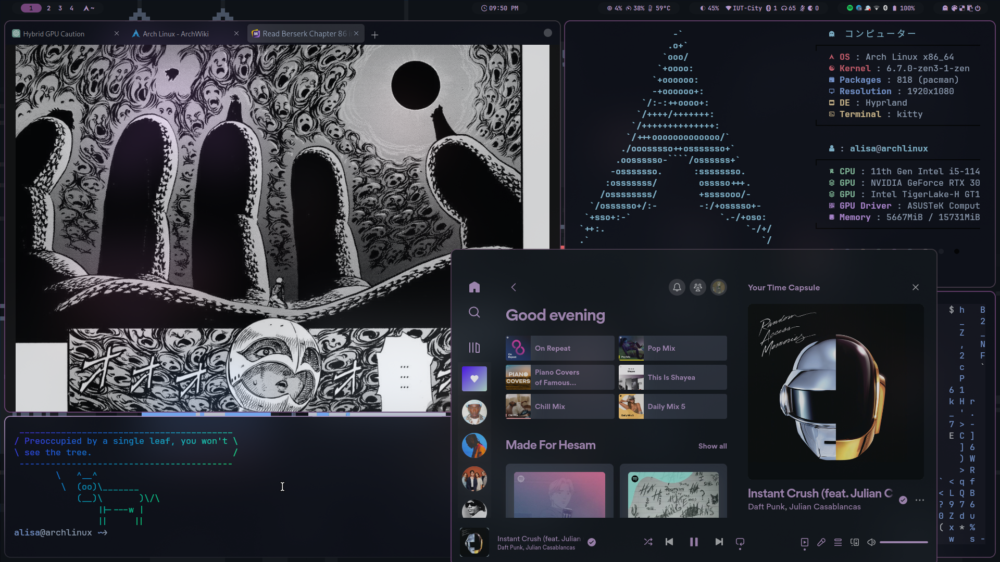

# Dotfiles
[Tracking dotfiles directly with Git](https://wiki.archlinux.org/title/Dotfiles#Tracking_dotfiles_directly_with_Git)

# Workflow
- [Arch linux](https://wiki.archlinux.org/)
- [Hyprland](https://hyprland.org/) ([Hyprdots](https://github.com/prasanthrangan/hyprdots))
- [Neovim](https://neovim.io/) ([Lazyvim](https://www.lazyvim.org/))
- [bash](https://www.gnu.org/software/bash/)
- [Kitty](https://sw.kovidgoyal.net/kitty/)

  
Screenshots

  

  

